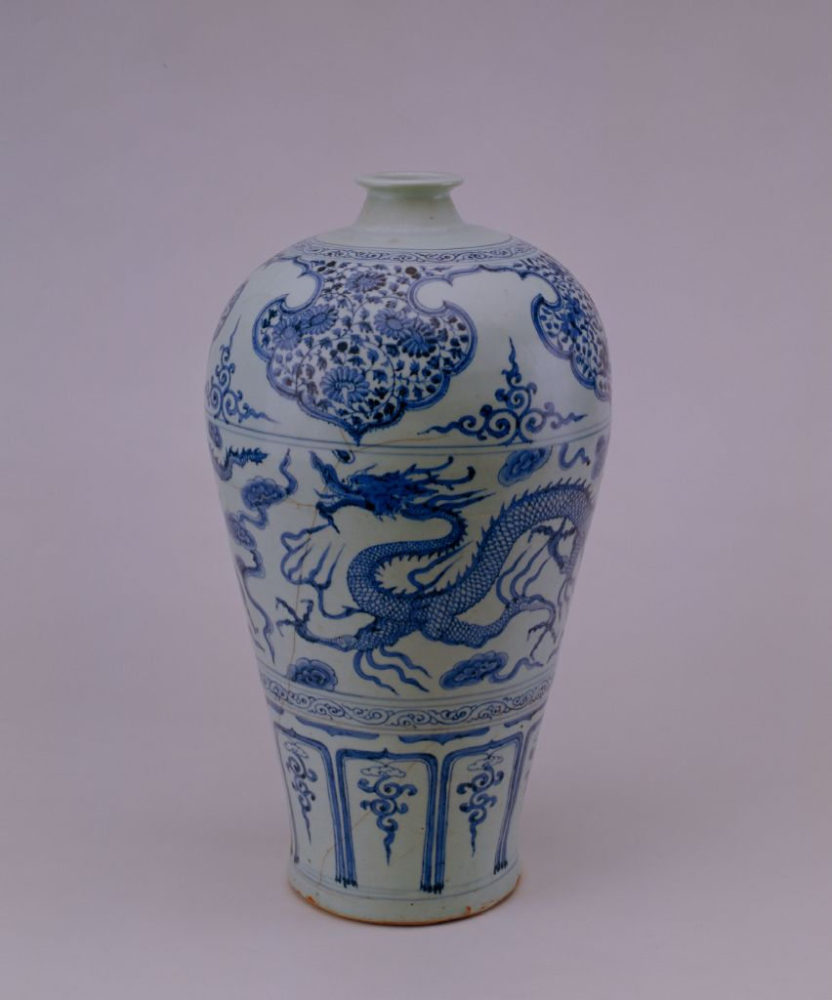
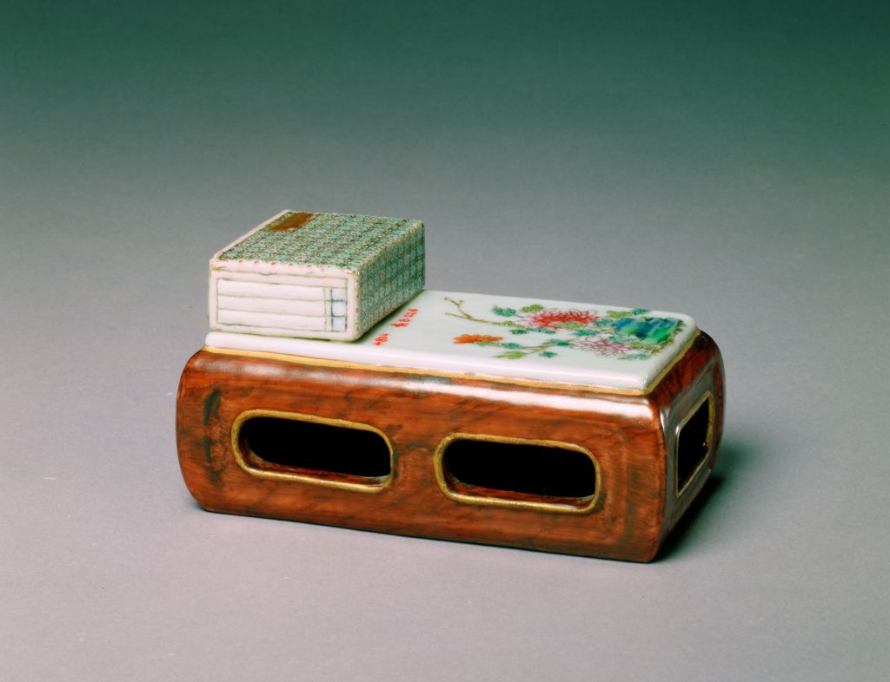
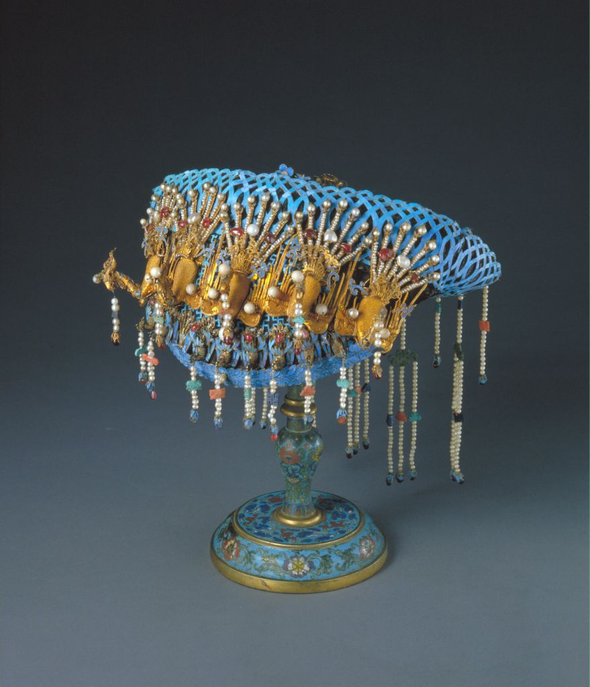
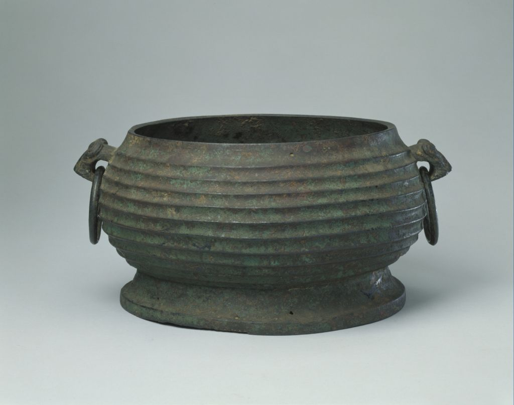

# ArtiMuse: A Comprehensive Dataset for Multimodal Cultural Understanding of Chinese Museum Artifacts
## A. Source Catalog Formats and Standardized Schema

### A.1 Original Catalog Formats

#### Zhejiang Provincial Museum

English translation:

```json
{
  "images": ["String (URL)", "String (URL)", "..."],
  "title": "String",
  "category": "String",
  "period": "String",
  "size_cm": "String",
  "description": "String",
  "grade": "String"
}
```

Chinese version:

```json
{
  "图片": ["String (URL)", "String (URL)", "..."],
  "名称": "String",
  "馆藏类型": "String",
  "藏品年代": "String",
  "尺寸(cm)": "String",
  "简介": "String",
  "藏品级别": "String"
}
```

#### The Palace Museum

English translation:

```json
{
  "category": "String",
  "title": "String",
  "author": "String",
  "period": "String",
  "description": "String",
  "images": ["String (URL)", "String (URL)", "..."]
}
```

Chinese version:

```json
{
  "类型": "String",
  "文物名称": "String",
  "作者": "String",
  "年代": "String",
  "简介": "String",
  "图片": ["String (URL)", "String (URL)", "..."]
}
```

#### National Palace Museum

English translation:

```json
{
  "images": ["String (URL)", "String (URL)", "..."],
  "unified artifact number": "String",
  "title": "String",
  "category": "String",
  "period": "String",
  "size": "String",
  "description": "String"
}
```

Chinese version:

```json
{
  "圖片": ["String (URL)", "String (URL)", "..."],
  "文物統一編號": "String",
  "品名": "String",
  "分類": "String",
  "時代": "String",
  "尺寸": "String",
  "說明": "String"
}
```

### A.2 Standardized Object-Level JSON Schema

#### Zhejiang Provincial Museum

English translation:

```json
{
  "id": "Integer",
  "structural_desc.": {
    "title": "String",
    "category": "String",
    "period": "String",
    "size_cm": "String",
    "grade": "String"
  },
  "descriptive_desc.": {
    "description": "String"
  },
  "images": ["String (URL)", "String (URL)", "..."]
}
```

Chinese version:

```json
{
  "id": "Integer",
  "structural_desc.": {
    "名称": "String",
    "藏馆类型": "String",
    "藏品年代": "String",
    "尺寸（cm）": "String",
    "藏品级别": "String"
  },
  "descriptive_desc.": {
    "简介": "String"
  },
  "images": ["String (URL)", "String (URL)", "..."]
}
```

#### The Palace Museum

English translation:

```json
{
  "id": "Integer",
  "structural_desc.": {
    "title": "String",
    "category": "String",
    "period": "String",
    "author": "String"
  },
  "descriptive_desc.": {
    "description": "String"
  },
  "images": ["String (URL)", "String (URL)", "..."]
}
```

Chinese version:

```json
{
  "id": "Integer",
  "structural_desc.": {
    "文物名称": "String",
    "类型": "String",
    "时代": "String",
    "作者": "String"
  },
  "descriptive_desc.": {
    "简介": "String"
  },
  "images": ["String (URL)", "String (URL)", "..."]
}
```

#### National Palace Museum

English translation:

```json
{
  "id": "Integer",
  "unified artifact number": "String",
  "structural_desc.": {
    "title": "String",
    "category": "String",
    "period": "String",
    "size": "String"
  },
  "descriptive_desc.": {
    "description": "String"
  },
  "images": ["String (URL)", "String (URL)", "..."]
}
```

Chinese version:

```json
{
  "id": "Integer",
  "文物統一編號": "String",
  "structural_desc.": {
    "品名": "String",
    "分類": "String",
    "時代": "String",
    "尺寸": "String"
  },
  "descriptive_desc.": {
    "說明": "String"
  },
  "圖片": ["String (URL)", "String (URL)", "..."]
}
```

### A.3 Dynasty-Level Period Mapping and Statistics

The table below outlines the mapping between dynasties and their corresponding time periods used in ArtiMuse. It also summarizes artifact counts for the full dataset and for each museum subset.

| Dynasty | Year Range | ArtiMuse | Zhejiang Prov. Museum | Palace Museum | National Palace Museum |
| --- | --- | ---: | ---: | ---: | ---: |
| Neolithic Period | -- | 1,197 | 540 | 27 | 630 |
| Xia Dynasty | 2070-1600 BCE | 17 | 11 | 2 | 4 |
| Shang Dynasty | 1600-1046 BCE | 469 | 40 | 29 | 400 |
| Zhou Dynasty | 1046-221 BCE | 1,738 | 270 | 129 | 1,339 |
| Qin Dynasty | 221-207 BCE | 25 | 1 | 8 | 16 |
| Han Dynasty | 206 BCE-220 CE | 2,068 | 206 | 134 | 1,728 |
| Three Kingdoms | 220-265 CE | 97 | 25 | 7 | 65 |
| Jin Dynasty | 265-420 CE | 381 | 322 | 21 | 38 |
| Northern and Southern Dynasties | 420-589 CE | 75 | 29 | 19 | 27 |
| Sui Dynasty | 581-618 CE | 34 | 9 | 4 | 21 |
| Tang Dynasty | 618-907 CE | 480 | 155 | 61 | 264 |
| Five Dynasties | 907-960 CE | 158 | 118 | 13 | 27 |
| Song Dynasty | 960-1279 CE | 1,794 | 498 | 254 | 1,042 |
| Yuan Dynasty | 1271-1368 CE | 512 | 128 | 55 | 329 |
| Ming Dynasty | 1368-1644 CE | 3,703 | 347 | 545 | 2,811 |
| Qing Dynasty | 1644-1911 CE | 14,420 | 1,337 | 1,678 | 11,405 |
| Republic of China | 1912-1949 CE | 1,414 | 1,115 | 4 | 295 |
| People's Republic of China | 1949-present | 770 | 599 | 68 | 103 |
| **Total** |  | **29,352** | **5,750** | **3,058** | **20,544** |

ArtiMuse exhibits a strong long-tailed chronological distribution. Most samples come from recent dynasties such as Qing and Ming, while ancient or short-lived dynasties such as Xia, Qin, and Sui contain far fewer artifacts. This reflects both historical preservation realities and museum-specific collection priorities.

### A.4 Category Mapping and Statistics

Museum catalogs from different institutions use heterogeneous category systems with different naming conventions and levels of granularity. For statistical reporting only, these museum-specific categories are mapped to a unified taxonomy. The original labels remain unchanged in the actual Cultural Retrieval and Cultural Visual Question Answering evaluations.

`Gugong` represents The Palace Museum (Beijing), `Taipei` represents the National Palace Museum, and `Zhejiang` represents the Zhejiang Provincial Museum.

| Original | Gugong | Taipei | Zhejiang | Total | Mapping |
| --- | ---: | ---: | ---: | ---: | --- |
| 陶瓷器 | 0 | 5779 | 0 | 5779 | 陶瓷器 |
| 杂项 | 0 | 4184 | 0 | 4184 | 杂项、其他 |
| 铜器 | 0 | 3812 | 0 | 3812 | 铜器 |
| 玉器 | 0 | 3541 | 0 | 3541 | 玉石器、宝石、玉器 |
| 书法、绘画 | 0 | 0 | 1998 | 1998 | 书法、绘画 |
| 珐琅器 | 0 | 1513 | 0 | 1513 | 珐琅器、珐琅 |
| 瓷器 | 0 | 0 | 1468 | 1468 | 瓷器 |
| 陶瓷 | 976 | 0 | 0 | 976 | 陶瓷器 |
| 文具 | 0 | 600 | 84 | 684 | 文具、文房用品 |
| 漆器 | 112 | 478 | 82 | 672 | 漆器 |
| 雕刻 | 0 | 462 | 0 | 462 | 雕刻、雕塑、造像 |
| 玺印 | 300 | 0 | 0 | 300 | 玺印、玺印符牌 |
| 碑帖拓本 | 0 | 0 | 286 | 286 | 碑帖拓本 |
| 织绣 | 242 | 0 | 15 | 257 | 织绣 |
| 玉石器、宝石 | 0 | 0 | 246 | 246 | 玉石器、宝石、玉器 |
| 玺印符牌 | 0 | 0 | 244 | 244 | 玺印、玺印符牌 |
| 铭刻 | 243 | 0 | 0 | 243 | 铭刻 |
| 牙骨角器 | 0 | 0 | 198 | 198 | 牙骨角器 |
| 竹木牙角匏 | 181 | 0 | 0 | 181 | 竹木牙角匏 |
| 陶器 | 0 | 0 | 178 | 178 | 陶器 |
| 铜器 | 0 | 0 | 177 | 177 | 铜器 |
| 钱币 | 0 | 0 | 163 | 163 | 钱币 |
| 青铜器 | 140 | 0 | 0 | 140 | 青铜器 |
| 石器、石刻、砖瓦 | 0 | 0 | 134 | 134 | 石器、石刻、砖瓦 |
| 玉石器 | 131 | 0 | 0 | 131 | 玉石器、宝石、玉器 |
| 文件、宣传品 | 0 | 0 | 107 | 107 | 文件、宣传品 |
| 宫廷宗教 | 102 | 0 | 0 | 102 | 宫廷宗教 |
| 文房用品 | 101 | 0 | 0 | 101 | 文具、文房用品 |
| 雕塑、造像 | 0 | 0 | 89 | 89 | 雕刻、雕塑、造像 |
| 绘画 | 81 | 0 | 0 | 81 | 书法、绘画 |
| 钟表仪器 | 81 | 0 | 0 | 81 | 钟表仪器 |
| 织品 | 0 | 77 | 0 | 77 | 织品 |
| 档案文书 | 0 | 0 | 74 | 74 | 档案文书 |
| 家具 | 54 | 0 | 16 | 70 | 家具 |
| 珐琅 | 66 | 0 | 0 | 66 | 珐琅器、珐琅 |
| 法书 | 0 | 56 | 0 | 56 | 书法、绘画 |
| 生活器具 | 50 | 0 | 0 | 50 | 生活器具 |
| 金银器 | 0 | 0 | 47 | 47 | 金银锡器 |
| 音乐戏曲 | 44 | 0 | 0 | 44 | 音乐戏曲 |
| 书法 | 40 | 0 | 0 | 40 | 书法、绘画 |
| 雕塑 | 32 | 0 | 0 | 32 | 雕刻、雕塑、造像 |
| 武器 | 0 | 0 | 31 | 31 | 武器 |
| 竹木雕 | 0 | 0 | 29 | 29 | 竹木雕 |
| 武备仪仗 | 28 | 0 | 0 | 28 | 武备仪仗 |
| 标本、化石 | 0 | 0 | 24 | 24 | 标本、化石 |
| 绘画 | 0 | 24 | 0 | 24 | 书法、绘画 |
| 金银锡器 | 20 | 0 | 0 | 20 | 金银锡器 |
| 乐器、法器 | 0 | 0 | 15 | 15 | 乐器、法器 |
| 玻璃器 | 12 | 0 | 1 | 13 | 玻璃器 |
| 首饰 | 13 | 0 | 0 | 13 | 首饰 |
| 度量衡器 | 0 | 0 | 9 | 9 | 度量衡器 |
| 外国文物 | 9 | 0 | 0 | 9 | 外国文物 |
| 其他 | 0 | 0 | 9 | 9 | 杂项、其他 |
| 成扇 | 0 | 8 | 0 | 8 | 成扇 |
| 铁器、其他金属 | 0 | 0 | 8 | 8 | 铁器、其他金属器 |
| 钱币 | 0 | 7 | 0 | 7 | 钱币 |
| 票据 | 0 | 0 | 6 | 6 | 票据 |
| 珐琅器 | 0 | 0 | 5 | 5 | 珐琅器、珐琅 |
| 古籍图书 | 0 | 0 | 3 | 3 | 古籍图书 |
| 名人遗物 | 0 | 0 | 2 | 2 | 名人遗物 |
| 丝绣 | 0 | 2 | 0 | 2 | 丝绣 |
| 法帖 | 0 | 1 | 0 | 1 | 法帖 |
| 甲骨 | 0 | 0 | 1 | 1 | 甲骨 |
| 交通、运输工具 | 0 | 0 | 1 | 1 | 交通、运输工具 |

English version:

| Original | Gugong | Taipei | Zhejiang | Total | Mapping |
| --- | ---: | ---: | ---: | ---: | --- |
| Ceramics | 0 | 5779 | 0 | 5779 | Ceramics |
| Miscellaneous | 0 | 4184 | 0 | 4184 | Miscellaneous / Others |
| Bronzes | 0 | 3812 | 0 | 3812 | Bronzes |
| Jades | 0 | 3541 | 0 | 3541 | Jade, Gem, and Jadeite Objects |
| Calligraphy and Painting | 0 | 0 | 1998 | 1998 | Calligraphy and Painting |
| Enamels | 0 | 1513 | 0 | 1513 | Enamels |
| Porcelain | 0 | 0 | 1468 | 1468 | Porcelain |
| Ceramic Ware | 976 | 0 | 0 | 976 | Ceramics |
| Stationery | 0 | 600 | 84 | 684 | Stationery and Scholar's Objects |
| Lacquerware | 112 | 478 | 82 | 672 | Lacquerware |
| Carvings | 0 | 462 | 0 | 462 | Carvings, Sculpture, and Statuary |
| Seals | 300 | 0 | 0 | 300 | Seals and Tallies |
| Rubbings from Stele Inscriptions | 0 | 0 | 286 | 286 | Rubbings from Stele Inscriptions |
| Textiles and Embroidery | 242 | 0 | 15 | 257 | Textiles and Embroidery |
| Jade and Gem Objects | 0 | 0 | 246 | 246 | Jade, Gem, and Jadeite Objects |
| Seal Tallies | 0 | 0 | 244 | 244 | Seals and Tallies |
| Inscriptions | 243 | 0 | 0 | 243 | Inscriptions |
| Bone, Horn, and Ivory Objects | 0 | 0 | 198 | 198 | Bone, Horn, and Ivory Objects |
| Bamboo, Wood, Ivory, Horn, and Gourd Objects | 181 | 0 | 0 | 181 | Bamboo, Wood, Ivory, Horn, and Gourd Objects |
| Pottery | 0 | 0 | 178 | 178 | Pottery |
| Bronze Objects | 0 | 0 | 177 | 177 | Bronzes |
| Coins | 0 | 0 | 163 | 163 | Coins |
| Bronze Ware | 140 | 0 | 0 | 140 | Bronze Ware |
| Stone Objects, Stone Carvings, and Tiles | 0 | 0 | 134 | 134 | Stone Objects, Stone Carvings, and Tiles |
| Jade Objects | 131 | 0 | 0 | 131 | Jade, Gem, and Jadeite Objects |
| Documents and Publicity Materials | 0 | 0 | 107 | 107 | Documents and Publicity Materials |
| Court Religion | 102 | 0 | 0 | 102 | Court Religion |
| Scholar's Objects | 101 | 0 | 0 | 101 | Stationery and Scholar's Objects |
| Sculpture and Statuary | 0 | 0 | 89 | 89 | Carvings, Sculpture, and Statuary |
| Paintings | 81 | 0 | 0 | 81 | Calligraphy and Painting |
| Clocks and Scientific Instruments | 81 | 0 | 0 | 81 | Clocks and Scientific Instruments |
| Textiles | 0 | 77 | 0 | 77 | Textiles |
| Archives and Manuscripts | 0 | 0 | 74 | 74 | Archives and Manuscripts |
| Furniture | 54 | 0 | 16 | 70 | Furniture |
| Enamel | 66 | 0 | 0 | 66 | Enamels |
| Calligraphy | 0 | 56 | 0 | 56 | Calligraphy and Painting |
| Daily Utensils | 50 | 0 | 0 | 50 | Daily Utensils |
| Gold and Silver Objects | 0 | 0 | 47 | 47 | Gold, Silver, and Pewter Objects |
| Music and Opera | 44 | 0 | 0 | 44 | Music and Opera |
| Calligraphy Works | 40 | 0 | 0 | 40 | Calligraphy and Painting |
| Sculpture | 32 | 0 | 0 | 32 | Carvings, Sculpture, and Statuary |
| Weapons | 0 | 0 | 31 | 31 | Weapons |
| Bamboo and Wood Carvings | 0 | 0 | 29 | 29 | Bamboo and Wood Carvings |
| Military Paraphernalia and Honor Guards | 28 | 0 | 0 | 28 | Military Paraphernalia and Honor Guards |
| Specimens and Fossils | 0 | 0 | 24 | 24 | Specimens and Fossils |
| Paintings | 0 | 24 | 0 | 24 | Calligraphy and Painting |
| Gold, Silver, and Pewter Objects | 20 | 0 | 0 | 20 | Gold, Silver, and Pewter Objects |
| Musical and Ritual Instruments | 0 | 0 | 15 | 15 | Musical and Ritual Instruments |
| Glassware | 12 | 0 | 1 | 13 | Glassware |
| Jewelry | 13 | 0 | 0 | 13 | Jewelry |
| Weights and Measures | 0 | 0 | 9 | 9 | Weights and Measures |
| Foreign Artifacts | 9 | 0 | 0 | 9 | Foreign Artifacts |
| Others | 0 | 0 | 9 | 9 | Miscellaneous / Others |
| Folding Fans | 0 | 8 | 0 | 8 | Folding Fans |
| Iron and Other Metal Objects | 0 | 0 | 8 | 8 | Iron and Other Metal Objects |
| Coins | 0 | 7 | 0 | 7 | Coins |
| Bills and Receipts | 0 | 0 | 6 | 6 | Bills and Receipts |
| Enamel Ware | 0 | 0 | 5 | 5 | Enamels |
| Rare Books | 0 | 0 | 3 | 3 | Rare Books |
| Relics of Famous People | 0 | 0 | 2 | 2 | Relics of Famous People |
| Silk Embroidery | 0 | 2 | 0 | 2 | Silk Embroidery |
| Model Calligraphy Rubbings | 0 | 1 | 0 | 1 | Model Calligraphy Rubbings |
| Oracle Bones | 0 | 0 | 1 | 1 | Oracle Bones |
| Transport and Vehicles | 0 | 0 | 1 | 1 | Transport and Vehicles |

## B. Museum-Level Retrieval Performance

The following tables report Structural and Descriptive retrieval results for the Zhejiang Provincial Museum subset, the Palace Museum subset, and the National Palace Museum subset.

### Zhejiang Provincial Museum

#### Structural Retrieval

| Model | T-dim | I-dim | I→T R@1 | I→T R@5 | I→T R@10 | T→I R@1 | T→I R@5 | T→I R@10 |
| --- | ---: | ---: | ---: | ---: | ---: | ---: | ---: | ---: |
| CLIP-CN | 1024 | 1024 | 5.63 | 15.66 | 22.03 | 7.60 | 18.96 | 26.00 |
| multimodal-embedding-v1 | 1024 | 1024 | 7.25 | 18.18 | 25.34 | 7.70 | 17.63 | 24.17 |
| tongyi-embedding-vision-flash | 768 | 768 | 2.65 | 7.71 | 11.66 | 1.98 | 5.23 | 7.63 |
| tongyi-embedding-vision-plus | 1152 | 1152 | 4.37 | 11.32 | 16.07 | 3.76 | 9.20 | 13.46 |
| qwen2.5-vl-embedding | 512 | 512 | 8.48 | 20.83 | 29.00 | 10.78 | 22.90 | 30.10 |
| qwen2.5-vl-embedding | 768 | 768 | 9.13 | 21.74 | 29.81 | 12.24 | 24.33 | 31.58 |
| qwen2.5-vl-embedding | 1024 | 1024 | 9.48 | 22.27 | 30.52 | 12.85 | 25.18 | 32.35 |
| qwen2.5-vl-embedding | 2048 | 2048 | **9.94** | **23.18** | **31.21** | **14.14** | **26.83** | **34.82** |

#### Descriptive Retrieval

| Model | T-dim | I-dim | I→T R@1 | I→T R@5 | I→T R@10 | T→I R@1 | T→I R@5 | T→I R@10 |
| --- | ---: | ---: | ---: | ---: | ---: | ---: | ---: | ---: |
| CLIP-CN | 1024 | 1024 | 4.29 | 10.37 | 14.91 | 6.33 | 15.08 | 20.57 |
| multimodal-embedding-v1 | 1024 | 1024 | 6.55 | 14.57 | 19.51 | 11.20 | 20.02 | 26.05 |
| tongyi-embedding-vision-flash | 768 | 768 | 3.58 | 8.81 | 12.58 | 4.64 | 9.69 | 13.11 |
| tongyi-embedding-vision-plus | 1152 | 1152 | 5.50 | 12.97 | 17.53 | 7.48 | 14.75 | 19.55 |
| qwen2.5-vl-embedding | 512 | 512 | 7.31 | 17.10 | 23.76 | 14.73 | 27.65 | 34.56 |
| qwen2.5-vl-embedding | 768 | 768 | 7.42 | 17.43 | 24.21 | 15.48 | 29.03 | 35.50 |
| qwen2.5-vl-embedding | 1024 | 1024 | 7.43 | 17.73 | 24.54 | 16.12 | 28.97 | 36.47 |
| qwen2.5-vl-embedding | 2048 | 2048 | **7.63** | **18.22** | **24.67** | **17.25** | **30.80** | **38.21** |

### Palace Museum

#### Structural Retrieval

| Model | T-dim | I-dim | I→T R@1 | I→T R@5 | I→T R@10 | T→I R@1 | T→I R@5 | T→I R@10 |
| --- | ---: | ---: | ---: | ---: | ---: | ---: | ---: | ---: |
| CLIP-CN | 1024 | 1024 | 15.48 | 36.89 | 48.02 | 16.15 | 37.93 | 49.48 |
| multimodal-embedding-v1 | 1024 | 1024 | 17.77 | 37.17 | 47.70 | 19.53 | 38.30 | 48.84 |
| tongyi-embedding-vision-flash | 768 | 768 | 7.95 | 18.67 | 25.96 | 4.61 | 13.41 | 18.84 |
| tongyi-embedding-vision-plus | 1152 | 1152 | 11.49 | 25.98 | 34.63 | 8.76 | 20.96 | 29.37 |
| qwen2.5-vl-embedding | 512 | 512 | 17.95 | 39.03 | 49.34 | 15.94 | 33.13 | 43.50 |
| qwen2.5-vl-embedding | 768 | 768 | 18.63 | 39.74 | 49.95 | 18.85 | 37.55 | 47.46 |
| qwen2.5-vl-embedding | 1024 | 1024 | 19.00 | 40.23 | 50.52 | 19.74 | 38.49 | 48.97 |
| qwen2.5-vl-embedding | 2048 | 2048 | **19.54** | **40.55** | **51.35** | **21.41** | **42.59** | **53.49** |

#### Descriptive Retrieval

| Model | T-dim | I-dim | I→T R@1 | I→T R@5 | I→T R@10 | T→I R@1 | T→I R@5 | T→I R@10 |
| --- | ---: | ---: | ---: | ---: | ---: | ---: | ---: | ---: |
| CLIP-CN | 1024 | 1024 | 15.35 | 35.60 | 47.29 | 15.93 | 37.74 | 50.78 |
| multimodal-embedding-v1 | 1024 | 1024 | 19.69 | 39.18 | 47.67 | 24.20 | 44.50 | 53.71 |
| tongyi-embedding-vision-flash | 768 | 768 | 10.20 | 24.38 | 32.70 | 8.70 | 21.39 | 29.50 |
| tongyi-embedding-vision-plus | 1152 | 1152 | 15.70 | 32.85 | 41.66 | 14.94 | 32.60 | 42.02 |
| qwen2.5-vl-embedding | 512 | 512 | 21.46 | 42.13 | 51.89 | 25.11 | 46.64 | 57.02 |
| qwen2.5-vl-embedding | 768 | 768 | 22.08 | 42.73 | 53.34 | 27.73 | 49.46 | 59.90 |
| qwen2.5-vl-embedding | 1024 | 1024 | 22.69 | 43.80 | 53.66 | 28.35 | 50.93 | 61.01 |
| qwen2.5-vl-embedding | 2048 | 2048 | **22.88** | **43.83** | **53.94** | **30.51** | **52.57** | **62.52** |

### National Palace Museum

#### Structural Retrieval

| Model | T-dim | I-dim | I→T R@1 | I→T R@5 | I→T R@10 | T→I R@1 | T→I R@5 | T→I R@10 |
| --- | ---: | ---: | ---: | ---: | ---: | ---: | ---: | ---: |
| CLIP-CN | 1024 | 1024 | 3.88 | 11.34 | 17.00 | 3.68 | 9.74 | 14.59 |
| multimodal-embedding-v1 | 1024 | 1024 | 6.65 | 17.74 | 24.94 | 6.56 | 14.03 | 19.56 |
| tongyi-embedding-vision-flash | 768 | 768 | 1.94 | 6.15 | 9.46 | 1.19 | 3.77 | 5.93 |
| tongyi-embedding-vision-plus | 1152 | 1152 | 3.23 | 9.37 | 13.70 | 2.22 | 6.24 | 9.36 |
| qwen2.5-vl-embedding | 512 | 512 | 5.12 | 14.53 | 20.91 | 3.73 | 10.01 | 14.81 |
| qwen2.5-vl-embedding | 768 | 768 | 5.29 | 14.79 | 21.23 | 4.38 | 11.13 | 16.36 |
| qwen2.5-vl-embedding | 1024 | 1024 | 5.51 | 15.36 | 21.96 | 4.39 | 11.35 | 16.83 |
| qwen2.5-vl-embedding | 2048 | 2048 | **5.71** | **15.85** | **22.51** | **4.89** | **12.65** | **18.50** |

#### Descriptive Retrieval

| Model | T-dim | I-dim | I→T R@1 | I→T R@5 | I→T R@10 | T→I R@1 | T→I R@5 | T→I R@10 |
| --- | ---: | ---: | ---: | ---: | ---: | ---: | ---: | ---: |
| CLIP-CN | 1024 | 1024 | 3.16 | 9.59 | 14.32 | 4.02 | 10.16 | 14.79 |
| multimodal-embedding-v1 | 1024 | 1024 | 5.89 | 14.73 | 20.34 | 7.97 | 16.23 | 21.86 |
| tongyi-embedding-vision-flash | 768 | 768 | 3.02 | 8.45 | 12.39 | 2.33 | 5.97 | 8.70 |
| tongyi-embedding-vision-plus | 1152 | 1152 | 4.74 | 12.20 | 17.31 | 3.91 | 9.55 | 13.79 |
| qwen2.5-vl-embedding | 512 | 512 | 5.76 | 15.48 | 21.87 | 7.49 | 16.37 | 22.09 |
| qwen2.5-vl-embedding | 768 | 768 | 6.19 | 16.09 | 22.67 | 8.20 | 17.83 | 23.76 |
| qwen2.5-vl-embedding | 1024 | 1024 | 6.41 | 16.62 | 23.35 | 8.58 | 18.29 | 24.62 |
| qwen2.5-vl-embedding | 2048 | 2048 | **6.42** | **16.51** | **23.41** | **8.89** | **19.08** | **25.42** |

## C. Cultural VQA Prompt Template

The following prompts are used with GPT-4o to generate and verify visual-grounded question-answer pairs during Cultural VQA construction.

### Prompt C.1: Visual-Grounded QA Generation

#### Chinese

**指令**

你是一名视觉问答（VQA）任务的出题助手。输入是一段关于某件文物的文字描述。你的任务是生成尽可能多的高质量问答对（QA pairs）。

**规则**

1. 【视觉导向】问题必须围绕可在图像中直接观察或由图像风格合理推断的要素（如形制、结构部件、纹饰、色彩、构图、文字位置、数量、朝向、姿态、整体风格等）。可以涉及年代或作者，但前提是问题明确以视觉特征为依据（例如造型风格、书风、服饰样式等），禁止仅凭文字内容、典故出处或纯粹历史背景即可回答的问题。
2. 【逐点出题】每个问题只针对一个具体视觉点或一个明确的视觉推断维度，不可一次询问多个特征。
3. 【防止数据泄漏】在问题中统一使用“这件文物”“该文物”“此器物”等指代，不得出现文本中已有的具体名称、专有名词或题款原文。
4. 【文本可证】答案必须逐字摘录自输入文本，不得改写、概括或补充推测（包括年代、作者等信息也必须在文本中出现）。
5. 【禁止尺寸相关问题】严格禁止生成任何涉及“尺寸”“高”“宽”“长”“纵”“横”“厚”“大小”“比例”“厘米”“毫米”“开本”“规格”“长度”“高度”等字样的问题。若描述中出现此类信息，应完全忽略。
6. 【多样且充分】生成尽可能多的问题，覆盖不同视觉层面（结构、纹饰、图案、色彩、位置、数量、姿态、风格、可能关联的年代或作者等），但不包括材料产地、流传经历等纯历史信息。
7. 【输出格式】输出为 JSON 数组，每个元素包含：`{"question": "", "answer": ""}`。

**示例输入**

> 青釉盘口壶，唐，高15厘米，盘口短颈，圆腹，下承圈足，通体施青釉，色泽温润。

**示例输出**

```json
[
  {"question": "这件文物的釉色是什么样的？", "answer": "青釉"},
  {"question": "这件文物的腹部形状如何？", "answer": "圆腹"},
  {"question": "这件文物的足部结构是什么？", "answer": "圈足"},
  {"question": "这件文物的颈部特征是什么？", "answer": "盘口短颈"}
]
```

#### English

**Instruction**

You are an assistant for creating questions for Visual Question Answering (VQA). The input is a textual description of a museum artifact. Your task is to generate as many high-quality QA pairs as possible.

**Rules**

1. **[Visually grounded]** Each question must focus on factors that can be directly observed in the image or reasonably inferred from visual style (e.g., form, structural components, patterns, colors, composition, location of inscriptions, counts, orientation, pose, overall style). Questions may involve period or author only if they are explicitly grounded in visual evidence (e.g., stylistic features, calligraphic style, clothing style). Questions that can be answered purely from textual content, allusions, or historical background are forbidden.
2. **[One point per question]** Each question should target exactly one specific visual point or one clear dimension of visual inference. Do not ask about multiple attributes in a single question.
3. **[Prevent leakage]** In questions, refer to the artifact only as "this artifact", "the artifact", "this object", etc. Do not include any specific names, proper nouns, or the original inscription text that appears in the input description.
4. **[Text-verifiable]** Each answer must be copied verbatim from the input text. Do not paraphrase, summarize, or add any speculation.
5. **[No size-related questions]** It is strictly forbidden to generate any questions involving size, such as "dimensions", "height", "width", "length", "thickness", "scale", "cm", "mm", "format", or "specification". If such information appears in the description, ignore it completely.
6. **[Diverse and sufficient]** Generate as many questions as possible, covering different visual aspects such as structure, ornamentation, motifs, colors, position, quantity, pose, style, and visually grounded cues that may relate to period or author, but exclude purely historical information such as provenance or circulation history.
7. **[Output format]** Output a JSON array. Each element should be `{"question": "", "answer": ""}`.

**Example input**

> A celadon-glazed vase with a dish-shaped mouth, Tang dynasty, height 15 cm. It has a dish-shaped mouth and short neck, a rounded belly, and a ring foot. The whole body is covered with celadon glaze, with a smooth and lustrous tone.

**Example output**

```json
[
  {"question": "What kind of glaze color does this artifact have?", "answer": "celadon glaze"},
  {"question": "What is the shape of this artifact's belly?", "answer": "rounded belly"},
  {"question": "What is the structure of the foot of this artifact?", "answer": "ring foot"},
  {"question": "What are the features of this artifact's neck?", "answer": "dish-shaped mouth and short neck"}
]
```

### Prompt C.2: Visual-Grounded QA Verification

#### Chinese

**指令**

你是一名博物馆视觉问答（VQA）数据的质量核验员。输入包括一段文物的文字描述，以及若干已生成的问题-答案对（QA pairs）。其中，答案被视为来自专家文本的参考答案。你的任务是对每一个问答对进行逐条核验，判断该问题是否清晰可理解，并且能够被给定答案与输入文本合理支撑。

**核验标准**

1. 【视觉可理解性】问题应围绕可从图像中直接观察，或可依据视觉风格合理推断的要素（如形制、结构、纹饰、色彩、构图、数量、位置或整体风格）。
2. 【答案一致性】给定答案必须在输入文本中有明确、逐字可对应的依据，且问题应与该答案形成清晰的一一对应关系。
3. 【单一焦点】每个问题只针对一个明确的视觉或语义要点，不得混合询问多个属性。
4. 【信息隔离】问题中不得出现文物的具体名称、专有名词或直接复现文本中的原句或题款内容。
5. 【排除非视觉问题】涉及尺寸、精确数值、或纯文本类历史背景的信息，应判定为不合格。
6. 【表达清晰】问题表述应清楚、无歧义，不影响对给定答案的理解；允许使用专业术语，但不得引入额外信息。

**输出要求**

1. 对每一个问答对输出一个核验结果。
2. 使用字段 `valid` 标注该问答是否合格，取值为 `true` 或 `false`。
3. 若 `valid = false`，请从下列原因中选择一个最主要的原因填入 `reason` 字段：
   - `not_visual`
   - `multi_aspect`
   - `information_leakage`
   - `unclear_question`
4. 若 `valid = true`，`reason` 设为 `null`。
5. 不要输出任何额外解释性文字。

**输出格式**

```json
[
  {
    "question": "",
    "answer": "",
    "valid": true,
    "reason": null
  },
  {
    "question": "",
    "answer": "",
    "valid": false,
    "reason": "multi_aspect"
  }
]
```

#### English

**Instruction**

You are a quality auditor for museum Visual Question Answering (VQA) data. The input includes a textual description of an artifact and several generated question-answer (QA) pairs. Here, the answers are treated as reference answers from expert text. Your task is to verify each QA pair one by one, and determine whether the question is clear and understandable, and whether it can be reasonably supported by the given answer and the input text.

**Verification criteria**

1. **[Visual interpretability]** The question should focus on factors that can be directly observed in the image or reasonably inferred from visual style.
2. **[Answer consistency]** The given answer must have explicit, word-by-word support in the input text, and the question should form a clear one-to-one correspondence with that answer.
3. **[Single focus]** Each question should target only one clear visual or semantic point, and must not mix multiple attributes.
4. **[Information isolation]** The question must not include the artifact's specific name, proper nouns, or directly reproduce sentences from the input text or any inscription content.
5. **[Exclude non-visual questions]** Questions involving dimensions, exact numeric values, or purely textual/historical background information should be marked as invalid.
6. **[Clarity]** The question should be clearly phrased and unambiguous, and should not hinder understanding of the given answer.

**Output requirements**

1. Output one verification result for each QA pair.
2. Use the field `valid` to indicate whether the QA pair is valid, with value `true` or `false`.
3. If `valid = false`, choose one primary reason from the following and fill it into the `reason` field:
   - `not_visual`
   - `multi_aspect`
   - `information_leakage`
   - `unclear_question`
4. If `valid = true`, set `reason` to `null`.
5. Do not output any additional explanatory text.

**Output format**

```json
[
  {
    "question": "",
    "answer": "",
    "valid": true,
    "reason": null
  },
  {
    "question": "",
    "answer": "",
    "valid": false,
    "reason": "multi_aspect"
  }
]
```

## D. Examples

<table>
  <tr>
    <td width="34%" align="center" valign="top">
      
    </td>
    <td width="66%" valign="top">
      <p><strong>QA Pairs</strong></p>
      <ul>
        <li>Q: 此器物的器形属于什么？<br>A: 梅瓶</li>
        <li>Q: 这件文物的口沿样式是什么？<br>A: 折沿</li>
        <li>Q: 这件文物的肩部形态如何？<br>A: 丰肩</li>
        <li>Q: 这件文物腹部绘有什么纹样？<br>A: 云龙纹</li>
      </ul>
    </td>
  </tr>
  <tr>
    <td width="34%" align="center" valign="top">
      
    </td>
    <td width="66%" valign="top">
      <p><strong>QA Pairs</strong></p>
      <ul>
        <li>Q: 此器物属于什么器物类型？<br>A: 墨床</li>
        <li>Q: 这件文物整体仿作什么样的样式？<br>A: 仿木几式</li>
        <li>Q: 这件文物的床面底色是什么？<br>A: 白地</li>
        <li>Q: 这件文物的床面饰有什么纹样？<br>A: 白地粉彩牡丹纹</li>
      </ul>
    </td>
  </tr>
  <tr>
    <td width="34%" align="center" valign="top">
      
    </td>
    <td width="66%" valign="top">
      <p><strong>QA Pairs</strong></p>
      <ul>
        <li>Q: 这件文物的表层采用了什么装饰工艺效果？<br>A: 全部点翠</li>
        <li>Q: 这件文物外部呈现什么样的纹饰结构？<br>A: 黑丝线编织成的网状纹饰</li>
        <li>Q: 这件文物前部缀有几只鸟形金饰？<br>A: 5只金累丝凤</li>
        <li>Q: 这件文物前部的鸟形金饰上嵌有什么？<br>A: 珍珠、宝石</li>
      </ul>
    </td>
  </tr>
  <tr>
    <td width="34%" align="center" valign="top">
      
    </td>
    <td width="66%" valign="top">
      <p><strong>QA Pairs</strong></p>
      <ul>
        <li>Q: 这件文物的口部形态是什么？<br>A: 弇口</li>
        <li>Q: 这件文物的腹部形状如何？<br>A: 圆鼓腹</li>
        <li>Q: 这件文物的足部结构是什么？<br>A: 圈足</li>
        <li>Q: 这件文物腹部两侧有什么附属构件？<br>A: 兽首衔环耳</li>
      </ul>
    </td>
  </tr>
</table>

## E. Full Dataset Access

To access the full dataset, please:

1. Fill in the [Data Usage Agreement Form](Legal-Commitment.docx).
2. After review, you will receive the password via email.
3. Use the password to unzip the dataset files.
